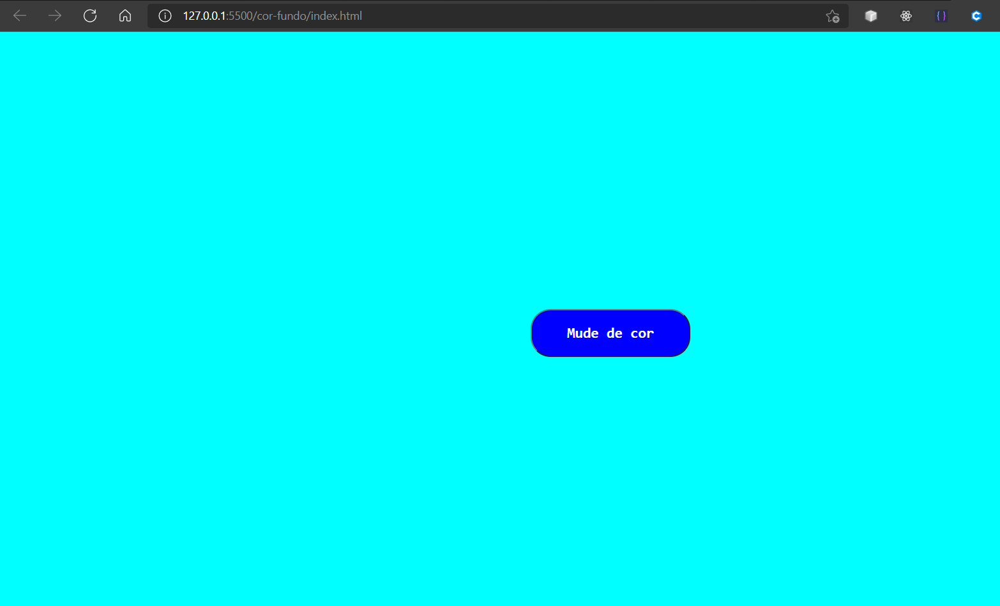
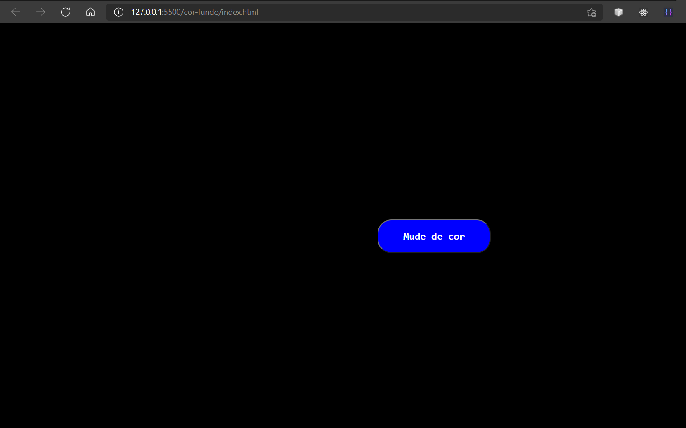

# Botão para clicar e mudar a cor de fundo

Fiz este projeto simples tirado de um site onde eles te dão 100 projetos com JavaScript do básico até o intermediário esse foi primeiro projeto que eles pedem para fazer.
Nesse projeto eu exercitei meu css, e alguns métodos do JavaScript como o random() e o floo() 

## O projeto é simples um botão no meio que ao ser apertado ele muda sua cor aleatóriamente.

## As cores estão em um array

